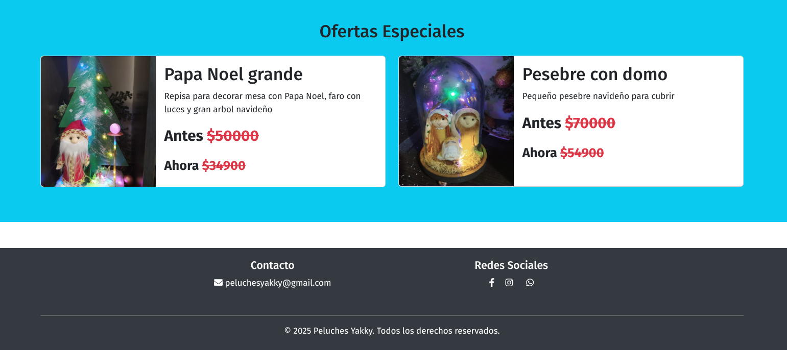

# Peluches-Yakky :bear:

Peluches Yakky es una empresa que hace peluches artesanales, busca hacerce conocer por medio de una página web que gestione las ventas y el carrito de compras que los usuarios hacen.

También cuenta con pedidos personalizados con atención por WhatsApp :telephone_receiver: y redes sociales :family: como Facebook y Instagram.

## Avances

Página principal:

Ofertas y redes sociales:

Sección de productos:

Detalles de cada producto:

